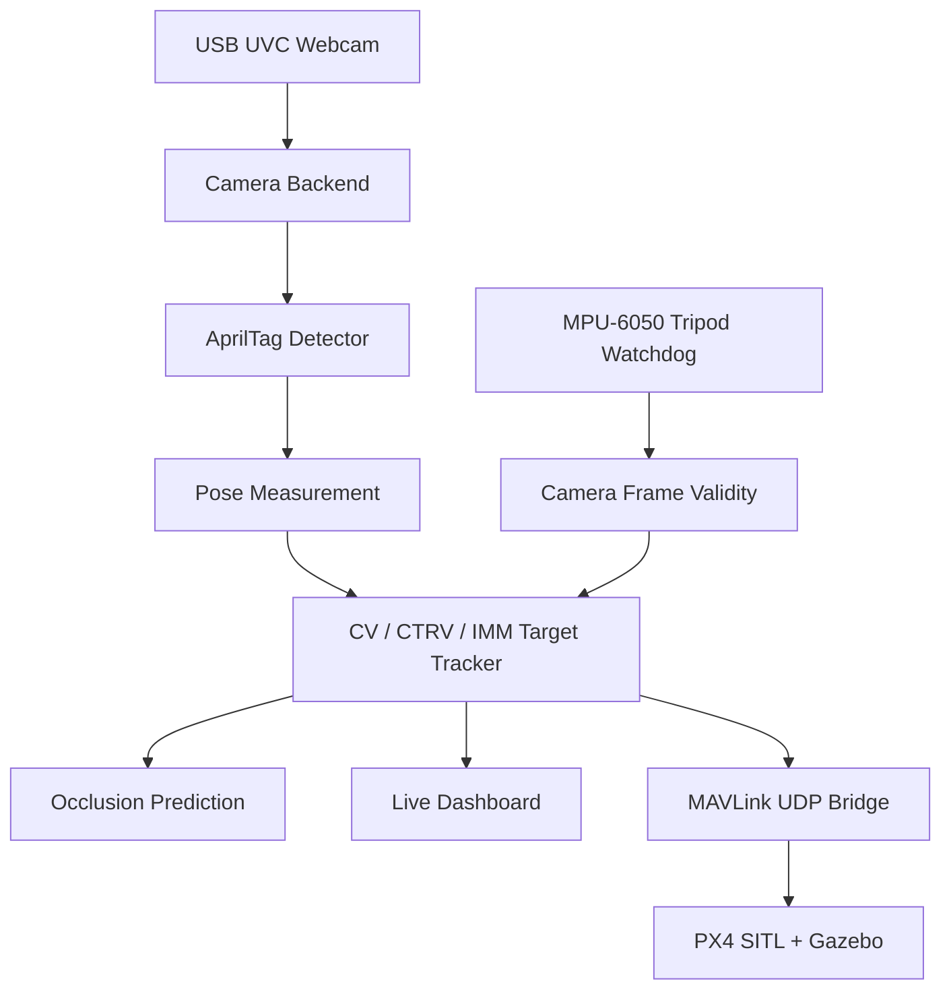

# GHOST V12 - USB Webcam Baseline Final Spec

**Project:** GPS-Denied Hardware Occlusion-Survivable Tracker  
**Owner:** Vinayak Manoj Nair  
**University:** Texas A&M University - B.S. Aerospace Engineering, Dec 2026  
**Target Roles:** GNC Engineer, Autonomy Engineer, Navigation Engineer  
**Target Companies:** Anduril, Shield AI, Skydio, JPL, Draper Laboratory  
**Repository:** `ghost-vins-eskf`  
**Status:** V12 final planning spec - USB UVC webcam baseline selected; evidence-first build phase ready  
**Last Updated:** June 20, 2026 11:29 PM CDT  

---

## Executive Decision

GHOST will use a standard USB webcam as the primary camera backend.

The IMX296 CSI camera is removed from the critical path. It remains a future stretch option only.

This is an engineering decision, not a downgrade:

- The USB webcam already works.
- The project value is in tracking, occlusion recovery, validation, and guidance.
- The IMX296 consumed schedule on driver, live-view, and exposure issues.
- A reliable demo with measured performance is stronger than ideal hardware that blocks progress.

The new goal is:

> Build a real-time GPS-denied target tracking system with AprilTag pose estimation, occlusion prediction, IMU tripod disturbance detection, validation plots, and PX4 SITL guidance, using a replaceable camera backend.

---

## What GHOST Does

A USB webcam and IMU sit on a static tripod and observe an RC car carrying an AprilTag.

The Raspberry Pi runs:

1. A vision front end that detects the AprilTag and estimates target pose.
2. A target tracker that continues predicting target motion during occlusion.
3. An IMU watchdog that detects if the tripod/camera frame was bumped.
4. A guidance bridge that sends MAVLink commands to PX4 SITL on a laptop.

When the car drives behind a shoebox, AprilTag measurements disappear. The tracker switches from `VISION` mode to `OCCLUDED` mode and coasts using a kinematic model. When the car reappears, the filter reacquires the measurement and logs the residual between predicted and observed position.

The IMU does not estimate car motion. It only monitors whether the camera platform moved.

No GPS. No physical flight controller. No fake target telemetry.

---

## Why This Is Still Recruiter-Grade

Recruiters and engineers will see features and proof:

| Feature | Visible Demo Result | Engineering Signal |
|---|---|---|
| Low-lag USB camera stream | Live view works immediately | Practical systems judgment |
| AprilTag overlay | Box, axes, tag ID, range, bearing | Computer vision pipeline |
| Occlusion mode | Predicted ghost target continues behind obstacle | Estimation beyond raw detection |
| Reacquisition residual | Error spike then correction after tag returns | Filter behavior is measurable |
| IMU bump watchdog | Camera-frame invalid flag turns on when tripod moves | Sensor fusion discipline |
| Dashboard telemetry | FPS, latency, NIS, mode, pose, MAVLink status | Real-time observability |
| Rosbag/video replay | Same test can be repeated | Debuggability and reproducibility |
| Benchmark comparison | Raw detector vs filtered tracker vs CTRV/IMM | Quantified algorithm value |
| PX4 SITL integration | Sim drone responds to target prediction | Full autonomy pipeline |

The USB webcam is just the sensor. The project grade comes from the system behavior.

---

## Hardware

### Baseline Hardware

| Component | Part | Role | Status |
|---|---|---|---|
| Compute | Raspberry Pi 4B | Edge compute and sensor interface | Available / required |
| Camera | Standard USB UVC webcam | Primary vision sensor | Baseline |
| IMU | MPU-6050 I2C breakout | Tripod/camera disturbance watchdog | Available |
| Target | RC car | Moving ground target | Required |
| Fiducial | AprilTag 36h11 tag0, 10 cm x 10 cm | Visual pose target | Required |
| Obstacle | Shoebox | Controlled occlusion | Available |
| Laptop | Windows/Linux laptop | PX4 SITL, Gazebo, analysis, optional viewer | Available |

### Optional / Stretch Hardware

| Component | Reason To Add Later | Not Required For MVP |
|---|---|---|
| USB global shutter camera | Reduces rolling-shutter distortion | Too expensive right now |
| ICM-42688-P IMU | Better IMU noise and SPI timing | MPU-6050 is enough for watchdog |
| IMX296 CSI camera | Global shutter and strobe timing | Removed from critical path |
| Physical Pixhawk | Hardware flight test path | SITL is enough for this project |

### What Not To Buy

| Item | Reason |
|---|---|
| USB global shutter camera right now | Cost does not justify current project stage |
| More CSI camera hardware | Camera stack already consumed too much schedule |
| Pixhawk | PX4 SITL accepts MAVLink over UDP and avoids hardware risk |
| Larger RC car | Higher speed increases blur and FOV problems |

---

## Camera Decision Record

The project will not use a numeric trade score until measured data exists for every option.

The camera decision is based on observed integration facts:

| Option | Observed Result | Decision |
|---|---|---|
| IMX296 CSI | Sensor enumerated and `cam` captured frames, but ROS/libcamera live streaming was unstable and consumed schedule | Remove from critical path |
| USB webcam | Already works as a standard UVC/V4L camera and can support low-lag live viewing | Use as baseline |
| USB global shutter | Best technical camera option, but too expensive for current project stage | Future upgrade only |

Decision rationale:

1. A working USB camera enables the real project features: AprilTag pose, occlusion recovery, watchdog logic, validation plots, and PX4 SITL.
2. The IMX296 has better shutter physics, but its current software stack risk is higher than its project value.
3. The architecture keeps the camera backend replaceable, so a future global-shutter camera can be added without rewriting the tracker.
4. The USB webcam limitation is documented as an operating-envelope constraint, not hidden.

The baseline decision is therefore: use the USB webcam now, finish the autonomy system, and keep global shutter as an explicit future sensor upgrade.

---

## System Architecture



---

## Frame Conventions

All vectors must state their frame. Frame errors are treated as system failures, not notation mistakes.

```text
F_cam_cv: OpenCV camera frame
  +x: image right
  +y: image down
  +z: camera optical axis forward

F_floor: physical demo floor frame
  +x: marked forward direction on floor
  +y: marked left/right floor direction
  +z: up from floor

F_tracker: 2D target tracking frame
  state uses [x_floor, y_floor] from F_floor
  z is ignored for the RC car target

F_gazebo: Gazebo world frame
  simulator world frame before MAVLink conversion

F_ned: MAVLink local NED frame
  +x: north/forward
  +y: east/right
  +z: down
```

Frame flow:

```text
AprilTag corners in image pixels
  -> solvePnP in F_cam_cv
  -> camera extrinsic transform into F_floor
  -> 2D tracker state in F_tracker
  -> sim-to-reality transform into F_gazebo
  -> explicit conversion into F_ned for MAVLink
```

Minimum logged fields per target update:

```text
t_meas
p_cam_cv
p_floor
p_tracker
p_gazebo
p_ned
frame_id
```

Rules:

| Rule | Reason |
|---|---|
| OpenCV camera frame is not NED | `+y` is down in the image |
| Tracker state is 2D floor motion | The RC car does not fly |
| MAVLink commands must be in local NED | PX4 interprets axes strictly |
| Every log row includes frame ID | Prevents silent frame mixing during analysis |

---

## Runtime Modes

| Mode | Trigger | Behavior | Demo Indicator |
|---|---|---|---|
| `VISION` | AprilTag detected | Use pose measurement to update tracker | Green tag box |
| `OCCLUDED` | Tag missing for N frames | Propagate target state with CV/CTRV | Yellow ghost target |
| `REACQUIRED` | Tag returns after occlusion | Apply measurement update and log residual | Blue correction vector |
| `CAMERA_SUSPECT` | Watchdog statistic exceeds warning threshold | Inflate vision measurement covariance | Orange warning |
| `CAMERA_BUMPED` | IMU watchdog detects tripod motion | Mark camera frame invalid and pause target update | Red warning |
| `PX4_GUIDANCE` | SITL link active | Send target-relative guidance over MAVLink | MAVLink status green |

---

## Live Dashboard Requirements

The demo must show a live viewer. Minimum fields:

```text
Camera FPS:        30
Detector FPS:      20-30
Latency:           measured_ms
Tag ID:            0
Range:             meters
Bearing:           degrees
Tracking Mode:     VISION / OCCLUDED / REACQUIRED
NIS Target:        PASS / FAIL
IMU Watchdog:      OK / CAMERA_BUMPED
PX4 Link:          CONNECTED / DISCONNECTED
```

Viewer overlays:

| Overlay | Purpose |
|---|---|
| AprilTag corner box | Confirms detector is working |
| Pose axes | Shows PnP orientation |
| Center-to-target line | Makes bearing obvious |
| Ghost prediction marker | Shows occlusion tracking |
| Covariance ellipse | Shows uncertainty growth |
| Reacquisition residual arrow | Shows correction after occlusion |

---

## Vision Pipeline

### Camera Backend

The vision system must not depend on one specific camera.

```text
CameraBackend
  open()
  read_frame()
  timestamp_frame()
  get_intrinsics()
  get_resolution()
  close()
```

Baseline implementation:

```text
UsbUvcCameraBackend
  device: /dev/videoX
  backend: OpenCV V4L2 or ROS2 usb_cam/v4l2_camera
  format: MJPG or YUYV, whichever gives lower latency
  resolution: 640x480 baseline
  fps: 30 target
```

### USB Timestamp Strategy

USB webcams do not provide reliable shutter-open hardware timestamps in this project.

Baseline approach:

```text
All timestamps use the Raspberry Pi CLOCK_MONOTONIC clock.

For each frame:
  1. dequeue/read newest camera frame
  2. immediately timestamp frame arrival: t_arrival
  3. estimate measurement time:

       t_meas = t_arrival - delta_cam

     where delta_cam is measured from the latency calibration test
```

Latency characterization:

| Quantity | Method | Use |
|---|---|---|
| `delta_cam_mean` | LED/stopwatch or screen-flash test | frame timestamp offset |
| `delta_cam_std` | repeated latency samples | jitter bound |
| frame interval jitter | camera timestamp log | dropped-frame detection |

Fusion rule:

```text
If delta_cam_std is small:
  use t_meas = t_arrival - delta_cam_mean

If delta_cam_std is large:
  inflate vision measurement covariance:
    R_time = J_t * sigma_t^2 * J_t^T

where J_t maps timestamp error into position error using target velocity.
```

The USB camera is not treated as time-perfect. Latency is measured, logged, and either compensated or absorbed into measurement covariance.

Future implementation:

```text
GlobalShutterCameraBackend
  same interface
  different device driver
  no estimator rewrite required
```

### AprilTag Front End

```text
USB frame
  -> grayscale conversion
  -> optional undistort
  -> AprilTag 36h11 detection
  -> solvePnP with calibrated USB camera intrinsics
  -> pose in camera frame
  -> transform to NED/local floor frame
  -> target tracker update
```

### Operating Envelope

| Parameter | Baseline |
|---|---|
| Tag family | 36h11 |
| Tag size | 10 cm x 10 cm |
| Range | 0.5 m to 3.0 m |
| Max oblique angle | Less than 45 degrees |
| Resolution | 640x480 first, 1280x720 optional |
| FPS target | 30 camera FPS, 20+ detector FPS |
| Lighting | Bright indoor lighting, avoid motion blur |
| Car speed | Bounded by measured AprilTag reliability |

### Calibration Acceptance

The MVP calibration pass threshold is reprojection error less than 0.8 px.

This is intentionally looser than the old IMX296 target of 0.5 px because the baseline camera is now a low-cost USB webcam with a cheaper lens, possible autofocus behavior, rolling-shutter readout, and weaker mechanical stability. The 0.8 px threshold is the MVP acceptance gate, not the stretch target.

| Calibration Level | Requirement | Use |
|---|---|---|
| MVP pass | Reprojection error < 0.8 px | Continue integration |
| Strong result | Reprojection error < 0.5 px | Preferred final demo |
| Fail | Reprojection error >= 0.8 px | Recalibrate before pose tracking |

The final report must state the measured calibration error instead of only saying pass/fail.

### Rolling-Shutter Limitation

Rolling shutter is accepted as a documented limitation.

The failure mechanism is specific:

```text
Moving AprilTag + rolling-shutter camera
  -> image rows are exposed at different times
  -> tag corners do not belong to one single instant
  -> estimated homography is skewed
  -> solvePnP receives biased corner geometry
  -> pose bias becomes correlated with target speed and direction
```

Mitigation:

| Mitigation | What It Controls |
|---|---|
| Bright lighting | Allows shorter exposure |
| Bounded car speed | Reduces row-to-row tag displacement |
| Residual/NIS gating | Detects biased pose updates |
| Speed-sweep test | Measures when pose error becomes unacceptable |
| Future global-shutter backend | Removes the row-time distortion source |

The webcam does not claim global-shutter performance. It is valid only inside the measured operating envelope.

---

## Target Tracker

### Baseline CV Filter

```text
State:
  x = [p_x, p_y, v_x, v_y]^T

Prediction:
  p_x <- p_x + v_x * dt
  p_y <- p_y + v_y * dt

Measurement:
  z = [p_x, p_y]^T from AprilTag pose projected into floor frame
```

### CTRV Upgrade

```text
State:
  x = [p_x, p_y, v, psi, psi_dot]^T

Use when:
  car turns during occlusion

Implementation:
  UKF sigma points preferred
  singularity guard when abs(psi_dot) is small
```

CTRV propagation:

```text
if abs(psi_dot) >= epsilon_psi_dot:
  p_x <- p_x + (v / psi_dot) * [sin(psi + psi_dot*dt) - sin(psi)]
  p_y <- p_y + (v / psi_dot) * [cos(psi) - cos(psi + psi_dot*dt)]
  psi <- psi + psi_dot * dt

else:
  # straight-line limit from L'Hopital / first-order series expansion
  p_x <- p_x + v * cos(psi) * dt
  p_y <- p_y + v * sin(psi) * dt
  psi <- psi
```

Initial threshold:

```text
epsilon_psi_dot = 1e-3 rad/s
```

Implementation note:

Use the straight-line limit when `abs(psi_dot) < epsilon_psi_dot` or when `abs(psi_dot * dt) < 1e-4`. This prevents division by near-zero turn rate and keeps the CTRV model continuous with CV motion.

### IMM Upgrade

IMM is stretch scope. If implemented, it must use the full IMM probability and covariance equations below, not an ad hoc model switch.

```text
Models:
  CV   - straight-line motion
  CTRV - constant turn-rate motion

Output:
  fused target state
  model probability
  covariance with spread term
```

Definitions:

```text
M models: i, j in {CV, CTRV}
mu_i(k-1): model probability from previous step
Pi_ij: Markov transition probability from model i to model j
Lambda_j(k): likelihood of measurement under model j
```

Recommended initial transition matrix:

```text
Pi =
  [0.95  0.05
   0.05  0.95]
```

Mixing probability:

```text
c_j = sum_i Pi_ij * mu_i(k-1)

mu_{i|j} = Pi_ij * mu_i(k-1) / c_j
```

Mixed initial condition for model j:

```text
x0_j = sum_i mu_{i|j} * x_i

P0_j = sum_i mu_{i|j} * [P_i + (x_i - x0_j)(x_i - x0_j)^T]
```

Model update:

```text
Run each filter j using x0_j, P0_j:
  predict
  update with AprilTag measurement if visible
  compute innovation y_j and S_j
```

Measurement likelihood:

```text
Lambda_j = N(y_j; 0, S_j)
         = exp(-0.5 * y_j^T S_j^-1 y_j) / sqrt((2*pi)^d * det(S_j))
```

Model probability update:

```text
mu_j(k) = Lambda_j * c_j / sum_l Lambda_l * c_l
```

Fused state and covariance:

```text
x_fused = sum_j mu_j * x_j

P_fused = sum_j mu_j * [P_j + (x_j - x_fused)(x_j - x_fused)^T]
```

The spread term is mandatory. Without it, covariance is underestimated when models disagree, and NIS becomes overconfident.

The tracker must prove that it adds value over raw AprilTag detection.

---

## Filter Consistency & Calibration

### Observability Boundaries

GHOST does not pretend every state is directly observable at every time.

| State / Quantity | Observable From | Limitation |
|---|---|---|
| Target 2D position | AprilTag pose projected into `F_floor` | Only while tag is visible |
| Target velocity | Time history of visible position measurements | Not observable from a single frame |
| Target turn rate | Curvature across multiple measurements | Weakly observable unless the car turns |
| Target state during occlusion | Kinematic prediction only | No new target measurement while hidden |
| Camera disturbance | MPU-6050 watchdog statistic | Detects camera-frame motion, not car motion |
| Absolute physical scale | AprilTag size and camera calibration | Limited by calibration and pose noise |
| Gazebo target position | Sim-to-reality transform | Requires calibrated scale, yaw, and origin offset |

During occlusion, uncertainty must grow. If the covariance does not grow while the tag is hidden, the filter is overconfident.

### Vision Measurement Noise

The Kalman measurement covariance `R_vision` is measured, not hand-tuned.

Procedure:

```text
For each static range r in {0.5 m, 1.0 m, 1.5 m, 2.0 m, 2.5 m, 3.0 m}:
  1. place AprilTag at known static position
  2. collect at least 300 valid detections
  3. compute pose samples in F_floor
  4. estimate covariance of [x_floor, y_floor]
  5. save mean, covariance, detection rate, and range
```

Empirical model:

```text
R_vision(r) =
  [sigma_x(r)^2      rho_xy(r)*sigma_x(r)*sigma_y(r)
   rho_xy(r)*sigma_x(r)*sigma_y(r)      sigma_y(r)^2]
```

Minimum implementation:

```text
Use nearest measured range bin for R_vision.
```

Preferred implementation:

```text
Fit sigma_x(r), sigma_y(r) as range-dependent curves.
Example:
  sigma_x(r)^2 = a_x + b_x*r^2
  sigma_y(r)^2 = a_y + b_y*r^2
```

Static AprilTag calibration estimates only the baseline vision covariance at zero target motion. It does not capture rolling-shutter motion bias.

The measurement covariance used in the tracker is:

```text
R_total = R_vision(range) + R_time(velocity, timestamp_jitter) + R_motion(speed)
```

Where:

| Term | Source | Purpose |
|---|---|---|
| `R_vision(range)` | Static AprilTag trials at fixed range | Corner jitter + PnP sensitivity |
| `R_time` | USB latency/jitter test and estimated target velocity | Position uncertainty from timestamp error |
| `R_motion` | Rolling-shutter speed sweep | Extra uncertainty from motion-induced pose bias |

Minimum implementation:

```text
R_total = R_vision(range) + R_time
```

If the speed sweep shows clear rolling-shutter bias, add `R_motion(speed)` or lower the allowed demo speed.

### NIS Consistency Test

For a 2D target position measurement:

```text
z = [x_floor, y_floor]^T
y = z - H*x_pred
S = H*P_pred*H^T + R_total

NIS = y^T * S^-1 * y
```

The measurement dimension is:

```text
dof = 2
```

Single-sample 95% gate:

```text
NIS <= chi2_0.95(dof=2)
NIS <= 5.991
```

Windowed consistency test:

```text
For a window of N visible measurements:
  T = sum_k NIS_k

Under a consistent filter:
  T ~ chi2(dof = 2N)

Two-sided 95% consistency interval:
  chi2_0.025(2N) <= T <= chi2_0.975(2N)
```

This is the Anderson-style two-sided chi-square consistency check used to detect both overconfident and underconfident covariance.

Assumption:

The windowed chi-square test assumes approximately independent innovations under nominal operation. Consecutive residuals can become correlated under model mismatch, bad `Q/R`, rolling-shutter bias, or timestamp error. Therefore, a failed windowed NIS test is treated as a soft consistency flag requiring residual-plot inspection, not as an automatic proof that the filter is invalid.

Dashboard interpretation:

| Display | Meaning |
|---|---|
| `NIS PASS` | Windowed NIS sum lies inside the two-sided chi-square interval |
| `NIS HIGH` | Filter is overconfident, `R`/`Q` likely too small or model wrong |
| `NIS LOW` | Filter is underconfident, `R`/`Q` likely too large |

Expected behavior:

```text
About 95% of individual 2-DOF visible measurements should fall below the 5.991 gate under nominal operation.
The stronger pass/fail condition is the two-sided windowed chi-square consistency test.
```

This prevents `NIS PASS/FAIL` from being a cosmetic dashboard label.

---

## IMU Watchdog

The MPU-6050 is used only to detect camera-platform motion.

It does not estimate car motion.

```text
MPU-6050 gyro + accel
  -> estimate short-window tripod attitude/motion
  -> compare against static baseline
  -> if persistent disturbance detected:
       camera_frame_valid = false
       target updates paused or downweighted
       dashboard shows CAMERA_BUMPED
```

### Watchdog Detection Statistic

The watchdog is a disturbance detector, not a full inertial navigation system.

The MPU-6050 has a higher noise floor than a better IMU such as the ICM-42688-P, so the detector must use a calibrated baseline and a persistent-window statistic. A raw threshold on a single sample is not acceptable.

Startup calibration:

```text
Collect 60 s static IMU data before demo:
  gyro bias:        b_g = mean(omega_m)
  gyro noise:       sigma_g = std(omega_m - b_g)
  accel norm mean:  a0 = mean(||a_m||)
  accel norm noise: sigma_a = std(||a_m|| - a0)
```

Runtime window:

```text
Window length: 100 ms
Sample rate:   measured MPU-6050 rate

omega_c[k] = omega_m[k] - b_g
a_norm[k]  = ||a_m[k]||

S_gyro = sqrt(mean(||omega_c[k]||^2 over window))
theta_window = ||sum(omega_c[k] * dt over window)||
S_accel = sqrt(mean((a_norm[k] - a0)^2 over window))
```

Fault declaration:

```text
CAMERA_BUMPED if any condition persists for 2 consecutive windows:

  S_gyro > max(5 * ||sigma_g||, gyro_floor_calibrated)
  OR
  theta_window > theta_min_calibrated
  OR
  S_accel > max(5 * sigma_a, accel_floor_calibrated)
```

Calibrated threshold outputs:

| Parameter | Source | Purpose |
|---|---|---|
| Window length | 100 ms | Reject single-sample spikes |
| Consecutive windows | 2 | Reject brief vibration |
| `gyro_floor_calibrated` | Phase 3 static + ambient vibration + tap tests | Avoid unrealistically low gyro threshold |
| `theta_min_calibrated` | Phase 3 tap tests | Detect real camera-frame rotation |
| `accel_floor_calibrated` | Phase 3 static + ambient vibration tests | Avoid false triggers from sensor noise |

No fixed numeric floors are claimed before calibration. The final report must list the calibrated values and the data used to choose them.

Tracker response:

| Watchdog State | Tracker Action |
|---|---|
| `OK` | Use vision measurement normally |
| `CAMERA_SUSPECT` | Inflate camera measurement covariance |
| `CAMERA_BUMPED` | Pause target updates until camera is revalidated |

### Watchdog Requirements

| Requirement | Method |
|---|---|
| Detect tripod bump | Manually tap tripod during test |
| Avoid false positives | 100 ms calibrated RMS/angle window, 2-window persistence |
| Characterize ambient vibration | 10 min static run in the actual final demo location |
| Log events | `logs/watchdog_events.csv` |
| Affect tracker | Pause or inflate measurement covariance |

---

## Guidance / PX4 SITL

GHOST keeps the original PX4 SITL guidance path.

```text
Target estimate in physical floor frame
  -> sim-to-reality transform
  -> target state in Gazebo frame
  -> ProNav / pursuit guidance
  -> SET_POSITION_TARGET_LOCAL_NED
  -> MAVLink UDP
  -> PX4 SITL
  -> Gazebo drone response
```

No physical flight controller is required.

### Ground Truth Convention

GHOST does not have motion-capture ground truth.

Validation uses the calibrated AprilTag pose as the reference measurement when the tag is visible. Tracker error during visible segments is measured against this unoccluded AprilTag pose, treated as ground truth within the camera calibration and rolling-shutter operating-envelope limits.

During occlusion, there is no direct target ground truth. The primary occlusion metric is reacquisition residual:

```text
e_reacq = z_tag_reacquired - H * x_predicted_at_reacquisition
```

Where:

```text
z_tag_reacquired: first stable AprilTag position after the target exits occlusion
H: measurement matrix from tracker state to measured target position
x_predicted_at_reacquisition: tracker prediction immediately before applying the measurement update
```

This gives a repeatable, honest metric:

| Segment | Reference Used | Reported Metric |
|---|---|---|
| Tag visible | Calibrated AprilTag pose | Position residual, NIS |
| Tag occluded | No direct ground truth | Prediction covariance growth |
| Tag reacquired | First stable AprilTag pose after occlusion | Reacquisition residual |
| Static tag | Known measured distance/position | Pose noise and bias |

The validation report must explicitly state: "Errors are relative to the calibrated AprilTag pose, not motion-capture ground truth."

### Sim-to-Reality Transform

The tracker estimates the car in a physical floor frame. PX4 SITL/Gazebo uses a simulated world frame. The transform must be calibrated before guidance.

Frame definitions:

```text
F_phys:
  origin: chosen floor reference point near the physical demo area
  x-axis: positive right/forward on the floor, marked with tape
  y-axis: positive perpendicular floor direction, marked with tape
  z-axis: ignored for car target; floor plane only

F_gazebo:
  origin: chosen Gazebo world reference point
  axes: simulator convention, explicitly converted before MAVLink NED command
```

2D physical-to-Gazebo mapping:

```text
p_gazebo_xy = s * R_2d(theta) * p_phys_xy + t_xy

R_2d(theta) =
  [ cos(theta)  -sin(theta)
    sin(theta)   cos(theta) ]
```

Parameters:

| Parameter | Meaning | Calibration Method |
|---|---|---|
| `s` | scale from physical meters to Gazebo meters | compare known physical tape distance to desired sim distance |
| `theta` | yaw alignment between physical floor axes and Gazebo axes | two-point alignment |
| `t_xy` | origin offset | map physical origin to Gazebo origin |

Calibration procedure:

1. Mark two known physical floor points, `P0_phys` and `P1_phys`.
2. Choose matching Gazebo world points, `P0_gazebo` and `P1_gazebo`.
3. Compute scale from segment lengths.
4. Compute yaw from segment directions.
5. Compute translation so `P0_phys` maps to `P0_gazebo`.
6. Validate with a third physical point not used in calibration.

Assumption:

The two-point calibration assumes a 2D similarity transform: uniform scale, yaw rotation, and translation only. It does not estimate shear, skew, non-uniform x/y scale, or warped coordinates.

If third-point validation fails, the similarity-transform assumption itself must be questioned. Do not only retune `s`, `theta`, and `t_xy`; check for axis convention mistakes, non-uniform scale, bad tape measurements, or Gazebo/PX4 frame handling errors.

Pass condition:

```text
||p_gazebo_predicted - p_gazebo_expected|| < 5 cm equivalent in the demo scale
```

Guidance conversion:

```text
target estimate in F_phys
  -> p_gazebo_xy using calibrated s, theta, t_xy
  -> convert Gazebo ENU/world convention to MAVLink LOCAL_NED
  -> send SET_POSITION_TARGET_LOCAL_NED acceleration/position command as configured
```

Rules:

| Rule | Reason |
|---|---|
| Do not assume physical and Gazebo origins coincide | Causes constant intercept bias |
| Do not assume axes align | Causes lateral guidance error |
| Do not apply XY scale to altitude | Car is floor target; drone altitude is controlled separately |
| Validate with a third point | Two points can fit while still hiding a bad convention |
| Treat third-point failure as a model failure candidate | Similarity transform may be insufficient |

---

## Development Phases

### Phase 1 - USB Camera MVP

| Task | Exit Criteria |
|---|---|
| Identify USB camera device | `/dev/videoX` confirmed |
| Low-lag live viewer | Human-visible delay acceptable and measured |
| Capture FPS measurement | Camera FPS logged |
| USB timestamp characterization | `delta_cam_mean`, `delta_cam_std`, frame jitter logged |
| Camera calibration | MVP < 0.8 px, stretch < 0.5 px; measured error reported |
| Vision measurement noise calibration | `R_vision(range)` measured from static AprilTag trials |
| AprilTag detection | Tag box visible in live viewer |
| Pose estimate | Range and bearing update live |
| Rolling-shutter speed sweep | Maximum usable car speed documented |

### Phase 2 - Tracking and Occlusion

| Task | Exit Criteria |
|---|---|
| CV tracker | Smooth target state during visible motion |
| Tag-loss detector | Correct transition to `OCCLUDED` |
| Ghost prediction marker | Continues behind shoebox |
| Reacquisition residual | Logged after tag returns |
| 10 occlusion trials | Mean and max drift reported |

### Phase 3 - IMU Watchdog

| Task | Exit Criteria |
|---|---|
| MPU-6050 stream | Stable sample rate |
| Static baseline | `b_g`, `sigma_g`, `a0`, `sigma_a` measured |
| Ambient vibration test | Zero persistent false faults in actual final demo location |
| Tripod bump detection | Dashboard warning appears |
| Tracker integration | Camera disturbance affects measurement trust |

### Phase 4 - Validation and Benchmarking

| Task | Exit Criteria |
|---|---|
| Ground-truth convention documented | AprilTag pose used as reference within calibration limits |
| Observability boundaries documented | Visible, occluded, and weakly observable states stated |
| Raw AprilTag baseline | Baseline error logged |
| CV tracker benchmark | Drift and reacquisition error logged |
| CTRV/IMM benchmark | Improvement during turning occlusion shown |
| NIS/residual plots | 2-DOF chi-square gate and windowed consistency saved |
| Replay mode | Same video/log can be replayed |

### Phase 5 - PX4 SITL Demo

| Task | Exit Criteria |
|---|---|
| Sim-to-reality transform calibrated | `s`, `theta`, `t_xy` measured and saved |
| Third-point transform validation | Projection error < 5 cm equivalent |
| MAVLink heartbeat | Pi/laptop link confirmed |
| PX4 command accepted | SITL logs show command stream |
| Gazebo drone motion | Drone responds to target state |
| Final demo video | Tracking, occlusion, reacquisition, SITL response |

---

## V&V Matrix

| ID | Requirement | Method | Pass Criteria |
|---|---|---|---|
| VV-01 | USB camera opens reliably | 10 launch attempts | 10/10 success |
| VV-02 | Live view latency measured | Stopwatch/LED flash test | Report mean and max |
| VV-03 | AprilTag detector FPS | Runtime counter | 20 FPS or higher |
| VV-04 | Camera calibration valid | Checkerboard calibration | MVP < 0.8 px, stretch < 0.5 px; report actual value |
| VV-05 | Vision measurement covariance calibrated | Static tag at multiple ranges | `R_vision(range)` saved |
| VV-06 | USB timestamp uncertainty bounded | Latency/frame-jitter test | `delta_cam_mean/std` saved |
| VV-07 | Pose estimate stable | Static tag test | Range noise reported |
| VV-08 | CV tracker works while visible | Drive straight line | Smooth state estimate |
| VV-09 | NIS consistency valid | 2-DOF windowed chi-square test | Windowed NIS inside 95% interval |
| VV-10 | Observability boundaries documented | Validation report | Visible/occluded/weak states stated |
| VV-11 | CTRV singularity guard works | `psi_dot` near zero unit test | finite output, CV-limit behavior |
| VV-12 | Occlusion prediction works | Shoebox test | Prediction continues while tag hidden |
| VV-13 | Reacquisition residual logged | Tag reappears | Error spike and correction recorded |
| VV-14 | CTRV improves turning case | Turning occlusion test | Lower residual than CV |
| VV-15 | Watchdog detects tripod bump | Manual tap test | `CAMERA_BUMPED` state appears |
| VV-16 | Watchdog avoids vibration false positives | Static 10 min run in actual final demo location | Zero persistent false faults |
| VV-17 | Watchdog thresholds are calibrated | Static, ambient vibration, and tap tests | calibrated floors saved with source data |
| VV-18 | Rolling-shutter speed envelope measured | Straight passes at increasing speed | Max reliable speed documented |
| VV-19 | Ground-truth convention documented | Validation report | AprilTag-as-reference assumption stated |
| VV-20 | Frame convention unit tests pass | Known transform tests | OpenCV -> floor -> Gazebo -> NED correct |
| VV-21 | Sim-to-reality transform calibrated | Two-point calibration and third-point validation | Error < 5 cm equivalent |
| VV-22 | PX4 SITL link works | MAVLink heartbeat | Connected status true |
| VV-23 | Guidance command accepted | PX4 log | Command stream visible |
| VV-24 | Replay mode deterministic | Replay same log 3 times | Same tracker output within tolerance |
| VV-25 | Final demo is repeatable | 5 full runs | 4/5 successful or better |

---

## Benchmark Plan

The project must compare against simpler baselines.

| Method | Visible Segment | Occluded Segment | Reacquisition | Expected Result |
|---|---|---|---|---|
| Raw AprilTag only | Works | Fails immediately | Jumps | Weak baseline |
| AprilTag + CV filter | Smooth | Straight-line prediction | Corrects | MVP |
| AprilTag + CTRV | Smooth | Handles constant turn | Corrects better | Strong |
| AprilTag + IMM | Smooth | Chooses CV/CTRV | Best generality | Stretch |

Metrics:

| Metric | Meaning |
|---|---|
| Detection FPS | Real-time vision performance |
| End-to-end latency | Camera to dashboard delay |
| Occlusion drift | Prediction error while tag hidden |
| Reacquisition residual | Difference between predicted and observed state |
| NIS | Filter consistency |
| Mode probability | IMM model confidence |

---

## FMEA

| Failure Mode | Effect | Detection | Mitigation |
|---|---|---|---|
| USB camera path changes | Camera node fails | Startup device check | Scan `/dev/video*` by name |
| Webcam autofocus changes image | Pose noise increases | Residual/NIS spike | Lock focus if supported, use fixed distance |
| Low light causes blur | Missed tags | Detector FPS and confidence drop | Add lighting, shorten exposure if possible |
| Rolling shutter distortion | Speed-correlated PnP pose bias from row-time skew | Residual grows with target speed/direction | Bright light, speed envelope, residual gating, future global-shutter backend |
| Vision `R` hand-tuned | Kalman gain not defensible | NIS high/low, reviewer asks tuning source | Empirical `R_vision(range)` from static tag data |
| Filter covariance overconfident | Tracker looks smooth but lies | NIS outside two-sided chi-square bound | Tune `Q`/`R`, report consistency test |
| Unobservable state treated as measured | False confidence during occlusion | Covariance fails to grow while tag hidden | Observability table and occlusion covariance check |
| AprilTag too small in frame | Detection loss | Tag area threshold | Use 10 cm tag and proper range |
| USB bandwidth issue | Dropped frames | FPS counter | Use 640x480 MJPG/YUYV first |
| USB timestamp jitter | Filter lag and biased residuals | Latency/frame-jitter test | Software timestamp, measured offset, covariance inflation |
| Tripod bumped | Target frame invalid | IMU watchdog | Pause/downweight vision updates |
| MPU-6050 noise floor too high | False bump events or missed small bumps | Static baseline and ambient vibration test | Calibrated RMS/angle statistic with 2-window persistence |
| Watchdog raw threshold too sensitive | False alarms | Static test | Never use raw single-sample threshold |
| Watchdog thresholds copied between locations | False positives or missed bumps | Actual demo-location vibration test | Recalibrate or rerun ambient test at final location |
| Ground truth overstated | Validation claims look stronger than evidence | Reviewer asks for reference source | State AprilTag-as-reference assumption and calibration bound |
| Sim-to-reality scale wrong | Drone intercepts wrong location | Third-point projection test fails | Calibrate `s`, `theta`, `t_xy` before PX4 demo |
| Similarity-transform assumption wrong | Good two-point fit but bad third-point projection | Third-point validation fails | Check shear/non-uniform scale/frame convention before tuning values |
| Physical/Gazebo origin mismatch | Constant guidance bias | Target offset visible in SITL | Explicit origin offset `t_xy` |
| CV model during turn | Prediction misses | Reacquisition residual high | CTRV/IMM upgrade |
| PX4 link down | No guidance | Heartbeat monitor | Dashboard warning and reconnect |
| ENU/NED mismatch | Drone moves wrong way | SITL trajectory | Transform unit tests |
| OpenCV camera frame treated as robotics frame | Pose axes silently wrong | Frame convention unit test | Explicit `F_cam_cv -> F_floor` transform |

---

## Critical Rules

| Rule | Reason |
|---|---|
| Never let camera debugging consume the project again | The camera is a backend, not the project |
| Never claim global shutter performance with a webcam | Document rolling-shutter limits honestly |
| Never use the tripod IMU to propagate car motion | It violates strapdown assumptions |
| Never use fake precision in trade studies | Unsourced scores look like post-hoc justification |
| Never hide relaxed thresholds | State why the number changed and report the actual measured value |
| Never threshold one raw IMU sample | MPU-6050 noise and vibration require a calibrated window statistic |
| Never claim motion-capture ground truth | Validation uses calibrated AprilTag pose as reference |
| Never skip sim-to-reality calibration | Scale, yaw, and origin offset drive guidance correctness |
| Never hand-tune `R_vision` without measurement data | Kalman gain must be defensible |
| Never call NIS pass/fail without a chi-square test | A label is not a consistency check |
| Never treat windowed NIS as an automatic hard fail | Correlated residuals violate the i.i.d. assumption |
| Never claim velocity or turn rate from one frame | These require time history |
| Never keep covariance flat during occlusion | No target measurement exists while tag is hidden |
| Never treat USB frame arrival time as shutter time | Webcam latency and jitter must be measured |
| Never leave frame conventions implicit | OpenCV, floor, Gazebo, and NED axes differ |
| Never reuse watchdog thresholds without environment check | Vibration coupling depends on the demo location |
| Never demo without live telemetry | Engineers need visible proof |
| Never show only a successful video | Show metrics, residuals, and failure handling |
| Never guess latency | Measure it and compensate or report it |
| Never use raw AprilTag only as the final feature | Tracking/occlusion is the differentiator |
| Never hide limitations | Bound them and test inside the envelope |

---

## Deliverables

| Deliverable | Required Content |
|---|---|
| Live demo | Webcam feed, AprilTag overlay, mode display, ghost prediction |
| README | Architecture, setup, commands, demo GIF/video |
| Validation report | FPS, latency, occlusion drift, reacquisition residual |
| Plots | Trajectory, residual, NIS, FPS, latency, `R_vision(range)` |
| Code | Camera backend, detector, tracker, watchdog, MAVLink bridge |
| Replay data | At least one reference video/log |
| Final video | 60-90 seconds, feature-focused |

---

## 95+ Feature Scorecard

| Category | Points | Requirement |
|---|---:|---|
| Reliable live demo | 20 | Runs without camera fight |
| AprilTag pose tracking | 15 | Live pose, range, bearing |
| Occlusion recovery | 20 | Ghost prediction and reacquisition |
| IMU watchdog | 10 | Detects tripod bump and affects tracker |
| Validation plots | 15 | Residual, NIS, latency, FPS |
| PX4 SITL integration | 10 | Drone responds to target estimate |
| Software architecture | 5 | Replaceable camera backend |
| Demo polish | 5 | Clear dashboard and video |
| **Total** | **100** | **Target: 95+** |

---

## Interview Q&A

### "Why did you use a USB webcam instead of the IMX296?"

The project goal is GPS-denied tracking and occlusion recovery, not camera driver development. I tested the IMX296 path and found the CSI/libcamera/ROS stack was consuming schedule and blocking real-time visualization. I made the camera backend replaceable and used a UVC webcam for the baseline so I could finish the autonomy pipeline. Global shutter remains a future sensor upgrade, but the estimator, watchdog, validation, and guidance architecture do not depend on it.

### "Does rolling shutter hurt your result?"

Yes. A rolling-shutter camera exposes different image rows at different times. If the AprilTag moves during readout, the four detected tag corners do not correspond to the same instant. That skews the tag homography, and solvePnP receives biased corner geometry. The result is a pose error correlated with target speed and direction.

I handle this as a measured operating-envelope limit: bright lighting, bounded car speed, residual/NIS gating, and a speed-sweep test that documents the maximum reliable demo speed. I do not claim global-shutter performance from a webcam.

### "What makes this more than AprilTag tracking?"

Raw AprilTag detection fails during occlusion. GHOST adds a target-state filter, prediction during tag loss, reacquisition residual logging, IMU-based camera-frame validity, and PX4 SITL guidance. The value is the full perception-estimation-guidance pipeline, not the detector alone.

### "What is the IMU doing?"

The IMU is on the tripod, so it cannot estimate car motion. It monitors camera-platform disturbance. If the tripod is bumped, the camera frame is no longer trusted, and the tracker pauses or inflates measurement covariance.

The watchdog is not a raw spike detector. I calibrate the MPU-6050 static gyro bias, gyro noise, accel norm mean, accel norm noise, and the final gyro/angle/accel floors from static data, actual demo-location vibration data, and manual tripod taps. The detector then runs a 100 ms windowed RMS/integrated-angle check with two-window persistence. That avoids triggering on single-sample vibration while still catching real camera-frame motion.

### "Why is the calibration target 0.8 px instead of 0.5 px?"

The old 0.5 px target assumed the better camera path. With a low-cost USB webcam, the MVP acceptance threshold is 0.8 px because the lens, mounting, autofocus behavior, and rolling-shutter readout are weaker. I still treat 0.5 px as the preferred final result. The final report will show the measured reprojection error, not just the pass/fail threshold.

### "How do you prove the tracker works?"

I compare raw AprilTag-only tracking against CV, CTRV, and optional IMM tracking. When the tag is visible, I treat the calibrated AprilTag pose as the reference measurement within the camera calibration error bound. During occlusion there is no direct ground truth, so I report prediction covariance growth and the reacquisition residual when the tag returns. I also report detection FPS, latency, NIS, and replayable test logs.

### "How do you know your covariance is not lying?"

I use NIS consistency testing, not just a smooth-looking trajectory. For a 2D target position update, `NIS = y^T S^-1 y` with 2 degrees of freedom. A single sample should fall below `chi2_0.95(2) = 5.991` about 95% of the time under nominal operation. For a window of `N` visible measurements, the sum of NIS values is tested against the Anderson-style two-sided chi-square interval with `2N` degrees of freedom. That windowed test assumes approximately independent innovations, so I treat failures as consistency flags that require residual-plot inspection, not automatic proof that the filter is invalid.

### "What is observable in this system?"

Target position is observable while the AprilTag is visible. Velocity and turn rate are inferred from a time history of position measurements, not from one frame. During occlusion, no new target measurement exists, so the filter only propagates a kinematic prediction and covariance must grow. The MPU-6050 observes camera-platform disturbance only; it never observes car motion.

### "How did you tune the vision measurement covariance?"

I do not hand-tune `R_vision`. I place the AprilTag at multiple static ranges, collect at least 300 detections per range, transform poses into the floor frame, and compute empirical covariance for `[x_floor, y_floor]`. The tracker uses `R_total = R_vision(range) + R_time(velocity, jitter) + R_motion(speed)`, so static corner/PnP noise, timestamp uncertainty, and rolling-shutter motion effects are separate additive terms.

### "How do you handle USB webcam timestamps?"

The USB webcam does not give me a trustworthy shutter-open hardware timestamp. I timestamp frame arrival using the Pi's monotonic clock, then subtract a measured camera latency offset from the LED/screen-flash test. I log mean latency, latency standard deviation, and frame interval jitter. If timing jitter is significant, I inflate measurement covariance based on target velocity and timestamp uncertainty.

### "What frame convention are you using?"

The camera pose starts in the OpenCV camera frame: `+x` image right, `+y` image down, `+z` optical axis forward. I explicitly transform that into the physical floor frame for tracking, then into Gazebo world, then into MAVLink local NED. Every log row includes frame IDs so I do not silently mix OpenCV, floor, Gazebo, and NED axes.

### "What happens to CTRV when yaw rate is near zero?"

I do not divide by near-zero turn rate. If `abs(psi_dot) < 1e-3 rad/s` or `abs(psi_dot*dt) < 1e-4`, I use the straight-line limit from L'Hopital / first-order expansion:

```text
p_x <- p_x + v*cos(psi)*dt
p_y <- p_y + v*sin(psi)*dt
```

That keeps the CTRV model continuous with the CV model.

### "How do you map the physical car position into Gazebo?"

I use a calibrated 2D sim-to-reality transform:

```text
p_gazebo_xy = s * R_2d(theta) * p_phys_xy + t_xy
```

Scale, yaw alignment, and origin offset are calibrated from two known physical points and validated with a third point. The two-point method assumes a similarity transform: uniform scale, yaw rotation, and translation. If the third point fails, I question that assumption instead of only retuning the values; the issue could be non-uniform scale, shear, bad tape measurements, or a Gazebo/PX4 frame convention error. Altitude is handled separately; I do not apply the floor-plane scale factor to drone altitude.

### "If you implement IMM, how do you avoid fake model switching?"

IMM is stretch scope, but if implemented it uses the standard transition matrix, mixing probabilities, model likelihoods from innovation covariance, and the fused covariance spread term. I do not just pick the model with the lower residual. The spread term is required so covariance grows when CV and CTRV disagree.

---

## Resume Bullet

```text
GHOST: GPS-Denied Occlusion-Survivable Target Tracker | ROS2, C++, Python, OpenCV, AprilTag, PX4 SITL

- Built a real-time vision-based target tracking system on Raspberry Pi using a USB UVC camera,
  AprilTag pose estimation, and a replaceable camera backend designed for future global-shutter upgrade.

- Implemented occlusion-aware target tracking with CV/CTRV models, ghost-state prediction during tag loss,
  reacquisition residual logging, and benchmark comparison against raw AprilTag-only tracking.

- Integrated an MPU-6050 tripod watchdog to detect camera-frame disturbances and prevent invalid vision
  updates after camera motion, enforcing the strapdown constraint that the desk IMU cannot propagate car motion.

- Added validation artifacts including empirical `R_vision(range)`, USB latency/jitter characterization,
  NIS chi-square consistency tests, occlusion residuals, and replayable logs to prove estimator behavior.

- Connected target estimates to PX4 SITL over MAVLink UDP, enabling a simulated drone to respond to the
  tracked target state without physical flight-controller hardware.
```

---

## Final Project Positioning

GHOST is not a webcam project.

GHOST is a GPS-denied autonomy project with:

- real camera input,
- real target motion,
- real occlusion,
- real IMU disturbance detection,
- real estimator validation,
- real MAVLink/PX4 integration,
- and a camera backend that can be upgraded later.

The normal USB webcam is the correct sensor for finishing a reliable, feature-rich, recruiter-visible system.

---

## README Note - What I Would Do Differently With More Time

The original camera plan used an IMX296 global-shutter CSI sensor because it offered better shutter behavior and a cleaner theoretical timing story. I pivoted to a USB UVC webcam after bring-up showed that the CSI/libcamera/ROS path was consuming schedule and blocking a reliable live demo. That was a deliberate systems decision: finish the estimator, occlusion behavior, validation, and PX4 SITL pipeline first, while keeping the camera backend replaceable. With more time, I would reintroduce a global-shutter camera only after the USB baseline is fully validated. I would also improve the watchdog and filter validation with external motion-capture or a second independent tracking reference, so NIS consistency and occlusion error could be checked against stronger ground truth instead of calibrated AprilTag pose alone.

---

## Confidence Ledger

This table states what each claim is allowed to mean. Any number in the final report must fit inside this evidence boundary.

| Claim Type | Validated Evidence | Still Assumed / Not Proven | Boundary Condition |
|---|---|---|---|
| USB camera reliability | 10/10 launch test, FPS log, live viewer latency test | Long-duration thermal/USB stability beyond demo length | Valid only for tested USB camera, port, resolution, and format |
| Camera calibration | Checkerboard reprojection error reported; MVP < 0.8 px, stretch < 0.5 px | Calibration may change if autofocus, zoom, mount, or resolution changes | Recalibrate after camera movement, focus change, or resolution change |
| Static position accuracy | Static AprilTag trials at measured ranges; pose noise and bias reported | Not motion-capture truth; AprilTag pose is the reference | Valid inside tested 0.5-3.0 m range envelope |
| Vision measurement covariance | `R_vision(range)` from static tag trials, at least 300 detections per range | Static test does not capture rolling-shutter motion bias | Use `R_total`, not `R_vision` alone, during motion |
| USB timestamp quality | `delta_cam_mean`, `delta_cam_std`, and frame jitter measured | No shutter-open hardware timestamp | Valid only for measured camera/backend/settings |
| Rolling-shutter operating envelope | Speed sweep documents max reliable car speed | Not validated above tested speed or lighting condition | Do not claim accuracy for car speeds beyond measured envelope |
| Tracker consistency | 2-DOF NIS gate and windowed chi-square consistency report | Windowed NIS assumes approximately independent innovations | Failed NIS is a soft flag requiring residual plot inspection |
| Occlusion drift | Reacquisition residual after shoebox occlusion | No direct ground truth while tag is hidden | Valid only for tested occlusion length, speed, and motion type |
| CTRV turning behavior | Turning occlusion benchmark vs CV | IMM is stretch unless implemented with full mixing equations | CTRV valid for tested turn rates and speed envelope |
| Watchdog disturbance detection | Static baseline, actual-location ambient vibration test, manual tap tests | Thresholds may not transfer to a new floor/table/tripod setup | Rerun ambient test and calibration in final demo location |
| Sim-to-reality projection | Two-point similarity calibration plus third-point validation < 5 cm equivalent | Similarity transform assumes uniform scale, no shear/skew | Third-point failure means question transform model, not only parameters |
| PX4 SITL guidance | MAVLink heartbeat, accepted commands, Gazebo response | Not a physical flight test | Claim SITL integration only, not hardware flight validation |
| Final demo repeatability | 5 full runs, target >= 4/5 successful | Does not prove all environments or camera settings | Valid for documented demo setup and lighting |

Confidence rule:

```text
If a claim is outside this ledger, it must be labeled as assumption, limitation, or future work.
```
