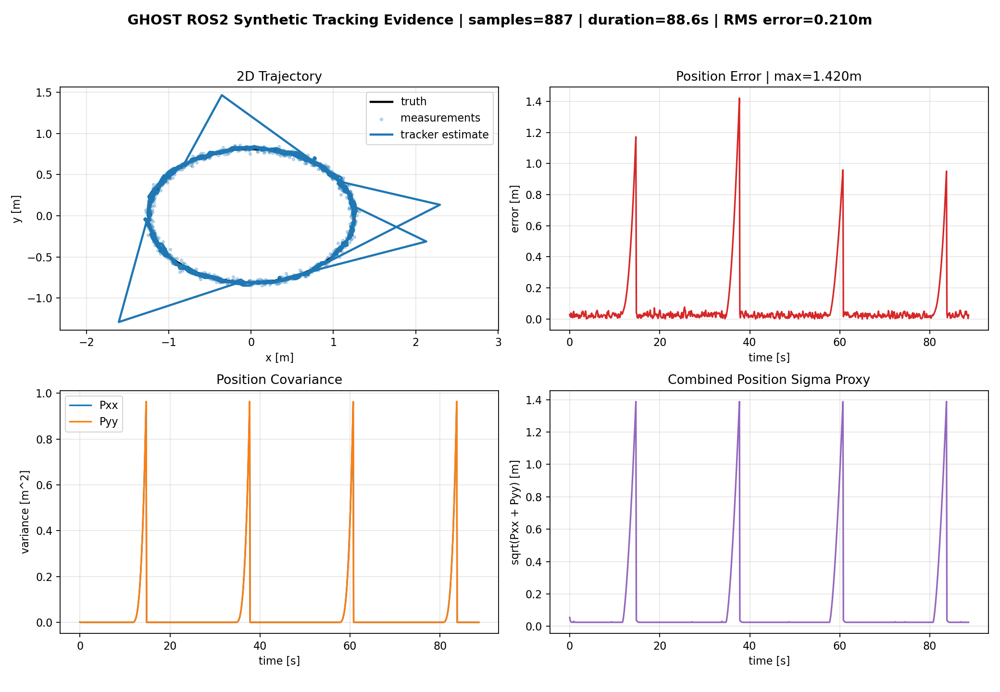
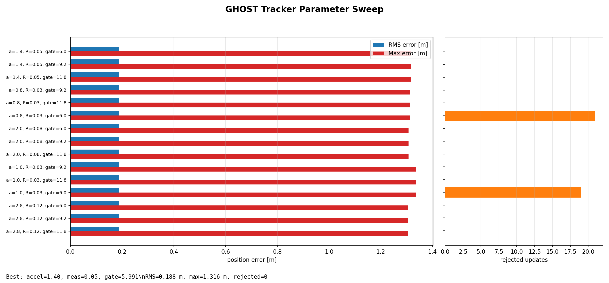

# GHOST Analysis Artifacts

This folder contains reproducible evidence outputs for the GHOST V12 USB webcam baseline.

## Current Evidence

### ROS2 Synthetic Tracking



Generated from:

```text
~/ghost_logs/sim_tracking.csv
```

The plot compares:

- simulated truth
- noisy camera-like measurements
- CV Kalman tracker estimate
- position error over time
- covariance behavior during dropout/coasting

### Tracker Sweep

`tracker_sweep.csv` ranks tracker parameter choices by RMS and max error.



The sweep is generated by:

```bash
python3 ~/ghost_ws/src/ghost_sim_ros2/analysis/ghost_offline_tracker_sweep.py
```

Current best result:

```text
RMS error: 0.188 m
Max error: 1.316 m
Rejected updates: 0
```

Interpretation: the remaining large max error is primarily caused by intentional target dropout/occlusion, not filter rejection.
