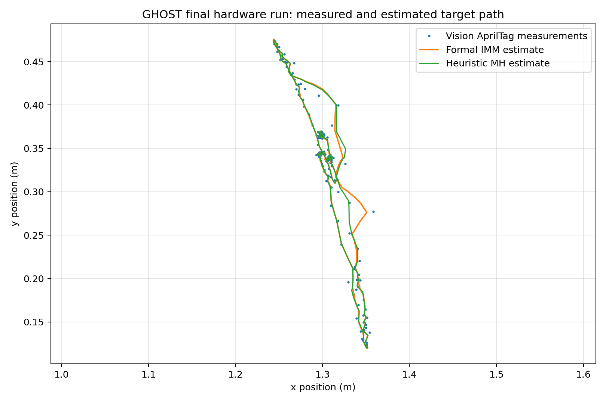
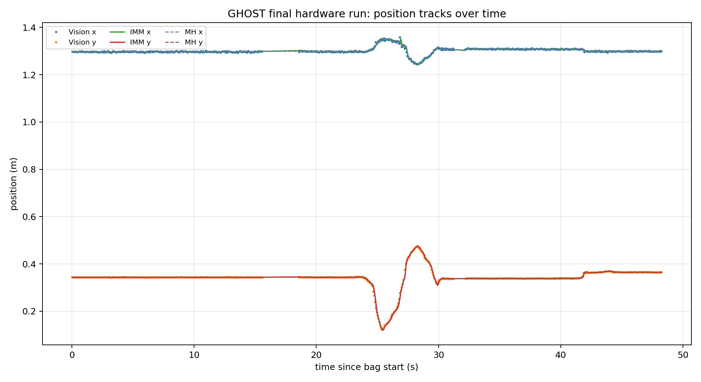
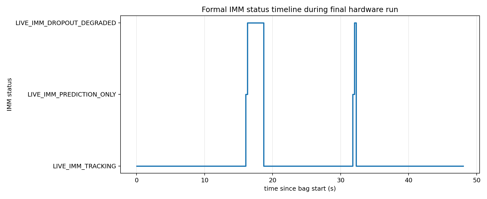
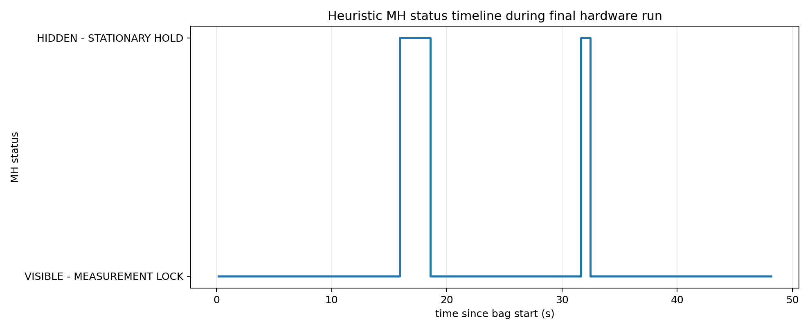
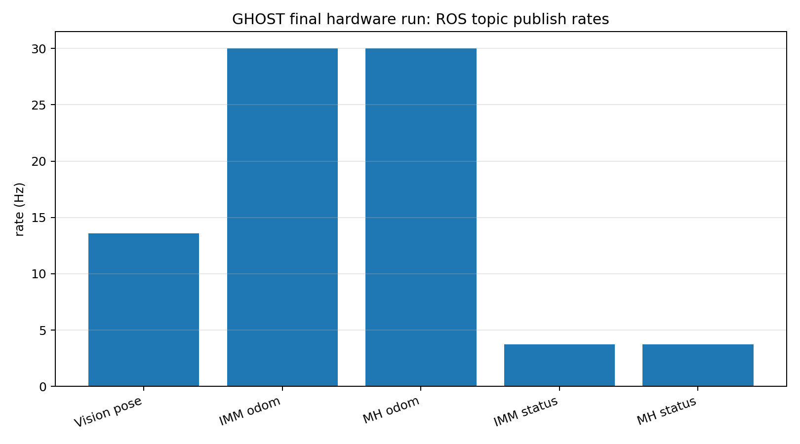

# GHOST Final Hardware Bag Plots

This page contains static GitHub-friendly plots generated from the final calibrated live hardware bag:

```text
~/ghost_ws/bags/live_camera_calibrated_R_01
```

Bag summary:

- Duration: 48.280 s
- Total messages: 6810
- Vision pose rate: 13.57 Hz
- IMM odometry rate: 30.01 Hz
- MH odometry rate: 29.99 Hz
- IMM statuses observed:
  - `LIVE_IMM_TRACKING`
  - `LIVE_IMM_PREDICTION_ONLY`
  - `LIVE_IMM_DROPOUT_DEGRADED`
- MH statuses observed:
  - `VISIBLE - MEASUREMENT LOCK`
  - `HIDDEN - STATIONARY HOLD`

## Target path



## Position tracks over time



## Formal IMM status timeline



## Heuristic MH status timeline



## ROS topic publish rates



## Reproduce

From the repository root on the Pi:

```bash
cd ~/ghost_ws/src/ghost_sim_ros2
source /opt/ros/jazzy/setup.bash
python3 tools/plot_live_bag.py ~/ghost_ws/bags/live_camera_calibrated_R_01
```
