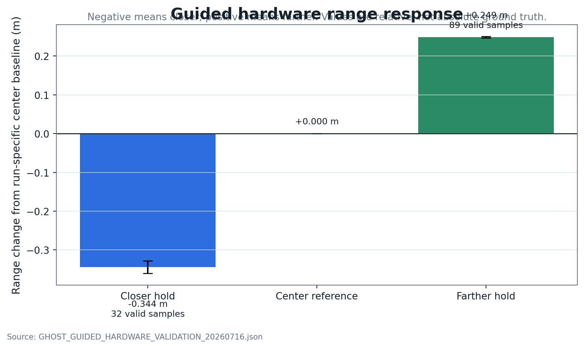
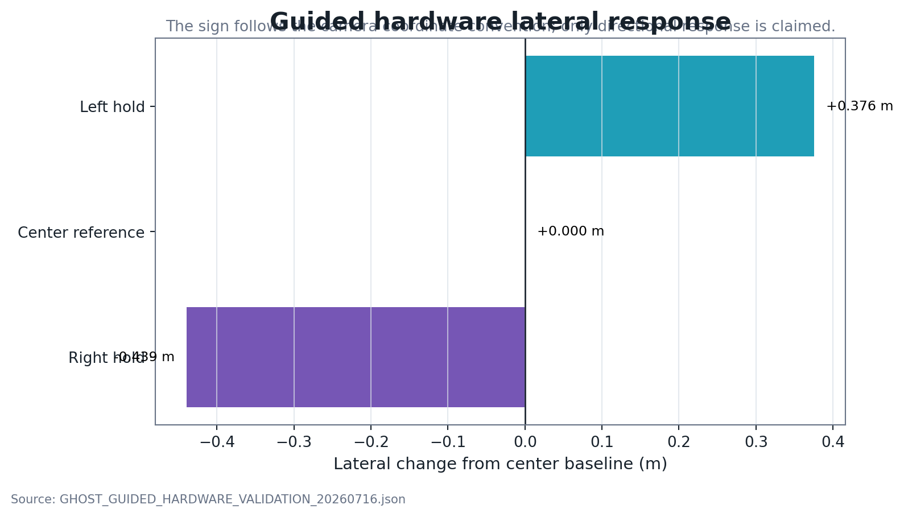
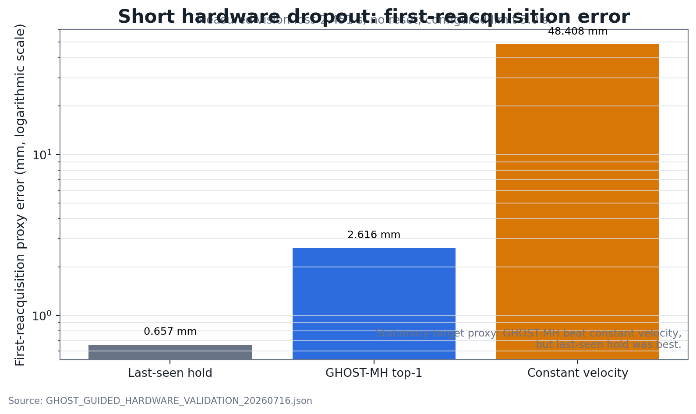
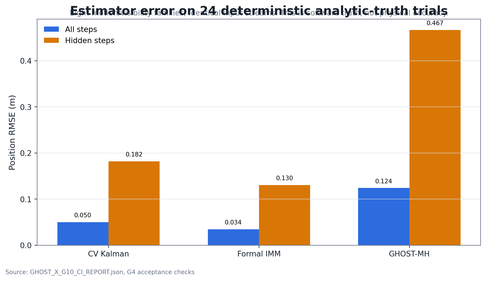
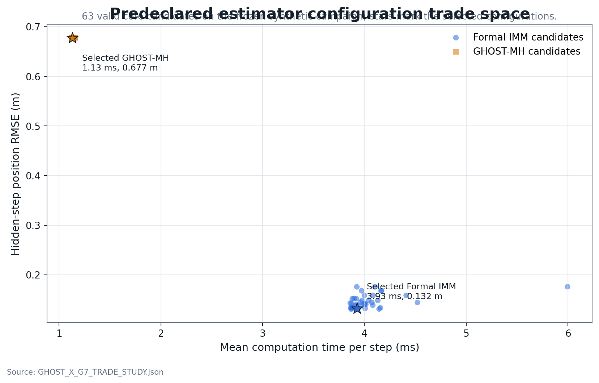
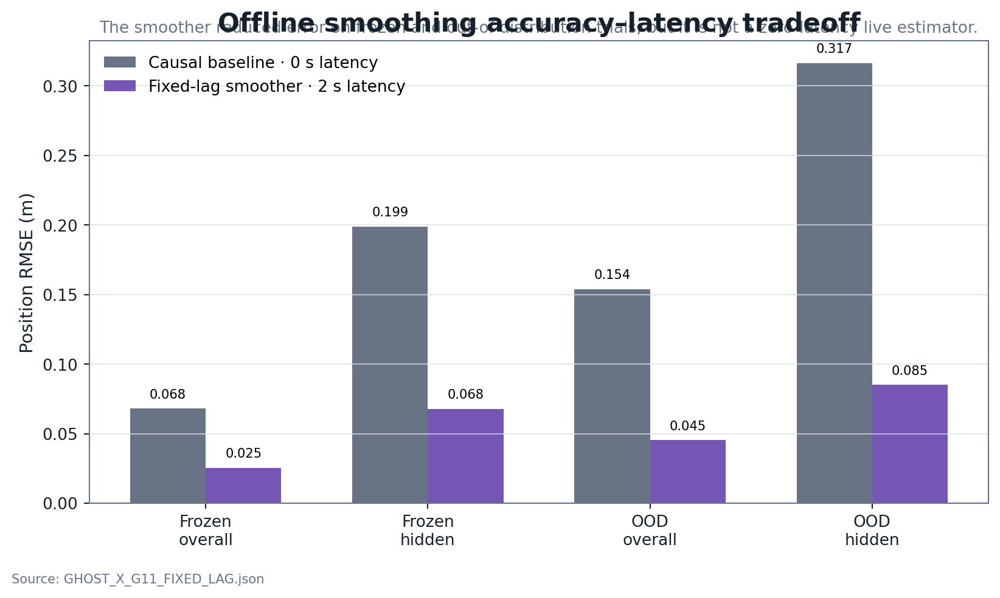
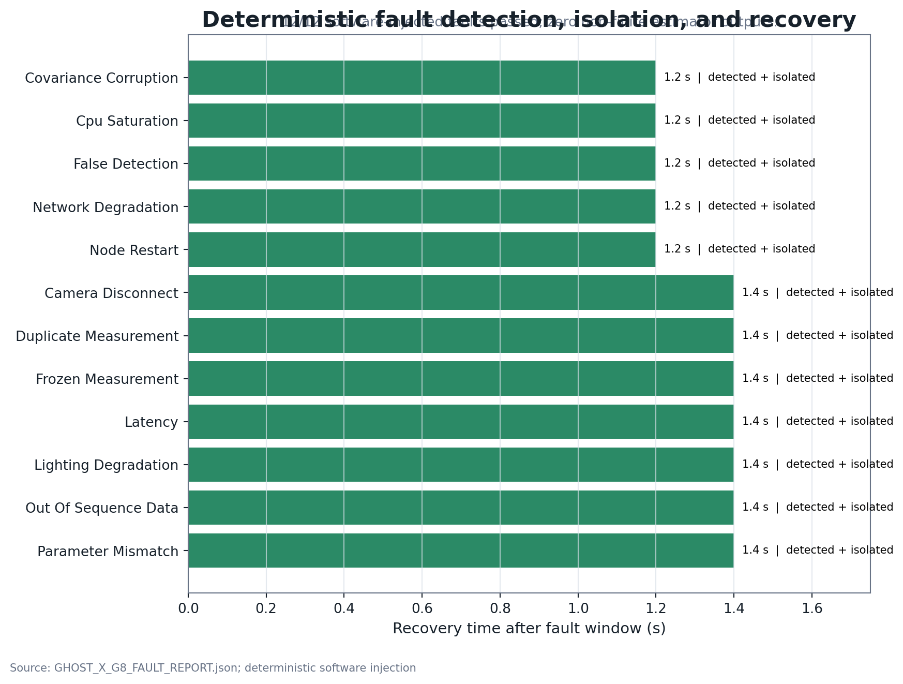
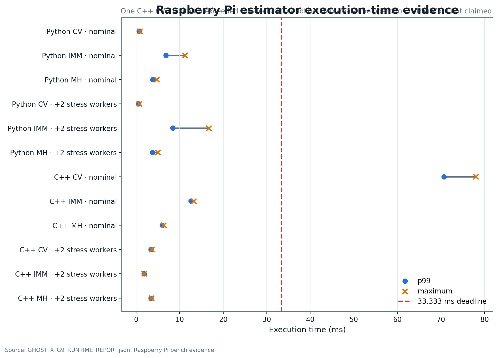
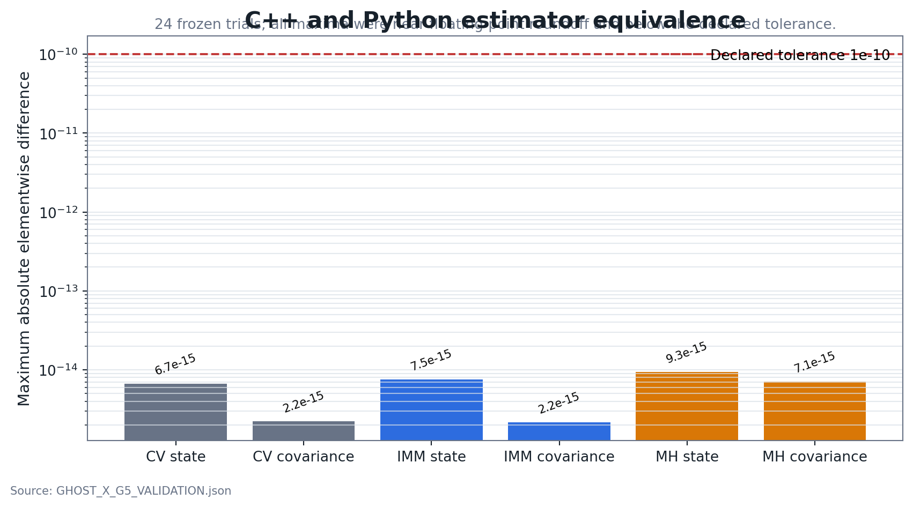

# GHOST-X Engineering Results

**Release:** `ghost-x-v1.0.0`  
**Platform:** Raspberry Pi, ROS 2 Jazzy, USB UVC camera, AprilTag pose, Python and C++ estimators  
**Public results page:** <https://xpiredruby.github.io/ghost-vins-eskf/>

## 1. Result summary

| Area | Result | Evidence scope |
|---|---:|---|
| Guided hardware dropout | `2.451 s` measured vision loss, reacquired without reset | Relative tabletop hardware behavior |
| GHOST-MH vs constant velocity | `94.6%` lower first-reacquisition proxy error | Stationary-target short-dropout proxy |
| Guided relative motion | Left, right, closer, farther and return-to-center passed | Directional response; no absolute ground truth |
| Controlled software truth | `24/24` accepted trials across eight scenario families | Deterministic analytic truth |
| Formal IMM controlled-truth RMSE | `0.0344 m` overall; `0.1305 m` hidden | Frozen software campaign |
| Fault injection | `12/12` faults passed detection, isolation and recovery | Deterministic software injection |
| Verification | `10/10` C++ tests, `38/38` Python tests, `47/47` CI gates | Frozen configurations and stored evidence |
| Traceability | `34/34` requirements mapped to tests and evidence | Release manifest |

The hardware and software-truth results are not combined into one accuracy claim. The hardware campaign validates relative response and bounded short-dropout reacquisition. Estimator RMSE comparisons use deterministic analytic software truth.

## 2. Hardware validation

### 2.1 Relative range response

The closer-only retest produced `32` valid hold samples and a `-0.344 m` change from its run-specific center baseline. The farther hold produced `89` valid samples and a `+0.249 m` change. Both directions were correct and returned close to the center baseline.

### 2.2 Relative lateral response

The left and right holds moved in opposite measured directions relative to the center baseline. This supports directional response only; the operator-guided motion is not metrology-grade truth.

### 2.3 Short-dropout reacquisition

The intended AprilTag occlusion produced a measured `2.451 s` vision gap. Reacquisition occurred without reset inside the configured `3.0 s` occlusion envelope.

- GHOST-MH top-1 proxy error: `2.616 mm`
- Constant-velocity proxy error: `48.408 mm`
- Last-seen stationary-hold proxy error: `0.657 mm`

GHOST-MH beat constant velocity in this trial, but did not beat the last-seen stationary hold. Universal estimator superiority is therefore not supported.

## 3. Estimator evaluation on deterministic analytic truth

### 3.1 Controlled-truth RMSE

The campaign used `24` accepted trials spanning eight motion and visibility-loss families. All estimators consumed identical input streams.

Formal IMM achieved the lowest overall and hidden-step RMSE in the frozen campaign. GHOST-MH remains useful as a different hypothesis-management architecture, but the results do not justify calling it the best estimator in every condition.

### 3.2 Predeclared candidate trade space

The trade study evaluated `36` formal-IMM candidates and `27` GHOST-MH candidates. Ranking used a frozen score combining overall error, hidden error, future prediction error, confidence behavior, computation time and reset rate.

This prevents selecting parameters only because they looked good after observing the final results.

## 4. Offline fixed-lag smoothing

A 20-step Rauch–Tung–Striebel fixed-lag smoother reduced overall and hidden RMSE on both frozen and out-of-distribution trials. The improvement came with `2.0 s` latency, so the smoother is presented as an offline or delayed estimator—not a causal live replacement.

## 5. Fault handling and runtime

### 5.1 Fault-injection campaign

All `12` deterministic fault cases passed the declared detection, isolation, explicit-status and recovery checks. Cases included camera disconnect, frozen and duplicate measurements, false detections, invalid covariance, latency, out-of-sequence data, node restart, CPU saturation, network degradation, configuration mismatch and lighting degradation.

No non-finite estimator outputs were recorded across the campaign.

### 5.2 Raspberry Pi execution-time evidence

The chart shows p99 and maximum execution times against the declared `33.333 ms` deadline. One C++ CV maximum exceeded the deadline, and the broader publication/latency requirements also missed their predeclared bounds.

The project therefore does **not** claim hard-real-time performance or certification.

## 6. C++ and Python implementation equivalence

The C++ and Python estimator outputs were compared across `24` frozen trials. Maximum elementwise state and covariance differences remained near floating-point roundoff and below the declared `1e-10` tolerance.

This establishes implementation agreement for the pinned inputs and configuration. It does not establish physical model accuracy.

## 7. Reproducibility and verification

- `10/10` C++ mathematical/property tests passed.
- `38/38` GHOST-X Python tests passed in CI.
- `47/47` deterministic replay and evidence checks passed.
- `123` generated files produced identical tree hashes across two complete replays.
- `34/34` requirements are traceable to tests and retained evidence.
- The public plots are regenerated directly from version-controlled JSON reports and are checked for deterministic output in CI.

Machine-readable page data:

- [Public results summary JSON](GHOST_PUBLIC_RESULTS_SUMMARY.json)
- [Public results table CSV](GHOST_PUBLIC_RESULTS_TABLE.csv)
- [Release manifest](GHOST_X_RELEASE_MANIFEST.json)
- [Final requirements traceability](GHOST_X_FINAL_TRACEABILITY.csv)

## 8. Failed or limited results retained

1. **Original floor-grid capture — rejected.** The camera/tag geometry was not moved between nominal grid positions. Its RMSE is not used as accuracy evidence.
2. **First closer-distance attempt — partial failure.** The closer hold had only two stable samples and one reset. The farther result was retained, and a smaller closer-only retest later passed.
3. **Stationary last-seen baseline — stronger in one trial.** It beat GHOST-MH during the stationary short-dropout proxy case.
4. **Runtime deadline — not fully met.** One maximum estimator timing row and the broader latency/publication requirements prevented a hard-real-time claim.

## 9. Approved conclusion

GHOST-X v1.0.0 is a reproducible Raspberry Pi and ROS 2 estimation platform with guided hardware evidence for relative motion response and bounded short-dropout reacquisition, plus deterministic software evidence for estimator comparison, implementation equivalence, fault handling, runtime characterization and release traceability.

It does not claim metrology-grade absolute position accuracy, statistically proven universal GHOST-MH superiority, SLAM/VIO, PX4 integration, hard-real-time certification, autonomous flight or flight qualification.
